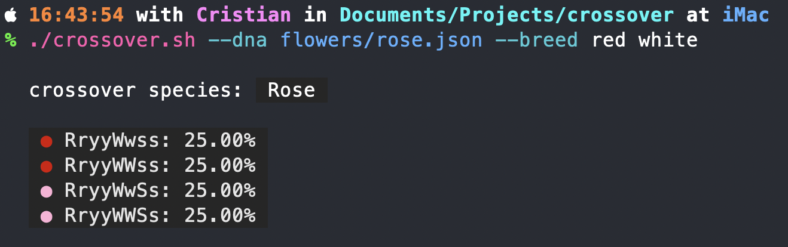

# Crossover

Program for genetics calculations of traits.
You can specify a DNA type and experiment with breeding.

Mainly used to breed **Animal Crossing: New Horizons**'
flowers and calculate possibilities of outcomes.

## Usage:

The program uses `Deno` not `node.js`.
You can install it, it's extra light (unlike node).
The program uses ansi color codes.

Make a `json` file containing the specification of the
DNA you're working with. There are some examples in the
`flowers` folder.



To list all the possible individuals with the given traits:

```zsh
./crossover.sh --dna flowers/windflower.json --list
```

To breed two individuals:

```zsh
./crossover.sh --dna flowers/windflower.json --breed 'RRooWW' 'rrOOWW'
```

To breed two seed flowers:

```zsh
./crossover.sh --dna flowers/rose.json --breed red white
```

# Note to Biologists

I'm not a Biologist, I don't even know all the different
technical terms you use. So if there's something wrong
let me know by firing an issue and I'll fix it.

Please don't roast me, I tried my best :)
